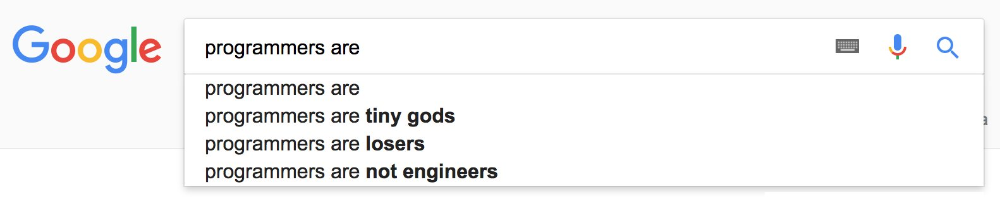

Co to jest programowanie, Python, i do czego można go wykorzystać
==================================================================

Python: co to jest ?
--------------------

* Język programowania
* Ogólnego przeznaczenia
* Czytelny i przejrzysty kod
* Dynamicznie typowany
* O otwartym kodzie źródłowym
* Interpretowany, nie kompilowany

Python: czym nie jest?
----------------------

To nie jest aplikacja !
To nie jest program !
To nie jest framework !

Python - używany m.in.:
-----------------------

* Apture
* Disqus
* Dropbox
* Google
* Hunch
* Instagram
* Mozilla
* Pinterest
* Reddit
* Slide
* SlideShare
* SurveyMonkey
* Twitter
* Yelp
* YouTube

Programista: Kto to jest ?
---------------------------

* Wynalazca
* Designer
* Górnik
* Detekyw
* Matematyk
* Anglista

* Ewolucja: Architekt
* Ewolucja: Manager

Programista: Jak zostać?
------------------------

* Angielski, angielski, angielski.
* Umiejętność kodowania w danym języku.
* Profil na Linkedin, Stackoverflow, Github.
* Umiejętności miękkie, szczególnie komunikatywność.

Co może pomóc:
* Znajomość Linuxa/Basha.
* Szczerość i bezpośredniość.

Programista w pracy:zagadki
------------------------------

* „Dlaczego ten kod działa?”
* „Jakim cudem nie działa?!”
* „O co chodziło autorowi?”

Programista w pracy:Warunki
----------------------------

* Praca zdalna
* Elastyczne (bardzo) godziny pracy
* Zadaniowy czas pracy
* Integracje
* Okresy wypowiedzenia wg. życzenia pracownika
* $$$
* [Kozy](https://www.youtube.com/watch?v=oHkqamFRTKI)

Python: kompendium
------------------
https://python.zeef.com/
