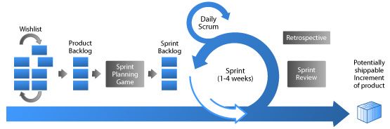

1.16 Agile i Scrum
=======================

Manifest programowania zwinnego
-------------------------------

(ang. Manifesto for Agile Software Development)

Odkrywamy nowe metody programowania dzięki praktyce w programowaniu
i wspieraniu w nim innych.

W wyniku naszej pracy, zaczęliśmy bardziej cenić:

*Ludzi i interakcje od* procesów i narzędzi
*Działające oprogramowanie* od szczegółowej dokumentacji
*Współpracę z klientem* od negocjacji umów
*Reagowanie na zmiany* od realizacji założonego planu.

Oznacza to, że elementy wypisane po prawej są wartościowe,
ale większą wartość mają dla nas te, które wypisano po lewej.

1. Naszym najwyższym priorytetem jest zadowolić klienta poprzez wczesne i ciągłe dostarczanie wartościowego oprogramowania.
2. Zmiany w wymaganiach, nawet późno w projekcie są mile widziane. Proces Agile zaprzęga zmianę do przewagi we współzawodnictwie na korzyść klienta.
3. Dostarczaj oprogramowanie często, w odstępach czasu od kilku tygodni do kilku miesięcy, preferując mniejsze odstępy czasowe.
4. Ludzie biznesu i deweloperzy muszą pracować razem codziennie przez cały projekt.
5. Buduj projekty w oparciu o zmotywowane indywidualności. Daj im środowisko i wsparcie, którego potrzebują i zaufaj im, że praca zostanie wykonana.
6. Najskuteczniejszą i najwydajniejszą metodą przekazywania informacji do i w zespole deweloperów jest rozmowa w cztery oczy.
7. Działające oprogramowanie jest podstawową miarą postępu.
8. Procesy Agile promują trwały rozwój. Sponsorzy, deweloperzy i użytkownicy powinni być w stanie utrzymać ciągłe tempo nieskończenie.
9. Ciągła koncentracja na technicznej doskonałości i dobrym projekcie (design) poprawia zwinność (agility).
10. Prostota – sztuka zwiększania ilości pracy niewykonanej – jest niezbędna.
11. Najlepsze architektury, wymagania i projekty wyłaniają się z samoorganizujących się zespołów.
12. W regularnych odstępach czasu, zespół zastanawia się jak stać się bardziej wydajnym, a następnie odpowiednio dostraja się i dopasowuje swoje zachowanie

SCRUM
-----

Metodologia, przy użyciu której ludzie mogą z powodzeniem rozwiązywać złożone problemy adaptacyjne, by w sposób produktywny i kreatywny wytwarzać produkty o najwyższej możliwej wartości.

Scrum jest:

* Lekki
* Łatwy do zrozumienia
* Bardzo trudny do opanowania

Role
----

* Product Owner
* Development Team
* Scrum Master

Product Owner odpowiedzialny za utrzymanie Product Backlogu. Jest ostatecznym źródłem informacji związanym z produktem dla Zespołu. Akceptuje lub odrzuca rezultaty pracy zespołu.

The Team samoorganizująca się, interdyscyplinarna grupa. W zespole nie ma hierarchii służbowej. Zespół decyduje o metodzie wykonania danego elementu z Backlogu

Scrum Master zapewnia maksymalną produktywność zespołu usuwając przeszkody. Zapewnia ścisłą współpracę w Zespole. Osłania zespół przed zewnętrznymi czynnikami mogącymi zaburzyć pracę, dba o ciągłą poprawę procesu, tak aby po każdej iteracji proces był lepszy i bardziej dojrzały

Artefakty
* Product Backlog
* Sprint Backlog
* Increment

Product backlog - uporządkowana lista wszystkiego, co może być potrzebne w produkcie oraz jedyne źródło wymaganych zmian, które mają być do produktu wprowadzone.

Sprint backlog - lista zadań, które należy wykonać to prognoza czyniona przez Zespół. Tylko Zespół może zmieniać swój Sprint Backlog w trakcie Sprintu

Increment - Przyrost - jest sumą wszystkich elementów Produktu Backlogu zakończonych podczas Sprintów. Na koniec Sprintu nowy przyrost musi być "Ukończony"
co oznacza, że jest w stanie pozwalającym na jego użycie i jest zgodny z Definicją Ukończenia (Definition of done) przyjętą przez Zespół.

Wydarzenia

* Daily (stand up)
* Sprint Planning
* Sprint Review
* Sprint Retrospective
* Sprint refinement

Daily (stand up) - codzienne spotkanie(do 15min.) na którym Zespół synchronizuje się. Członkowie Zespołu mówią co robili i co zamierzają robić

Planowanie spotkanie na którym Zespół Scrumowy wspólnie określa co będzie realizowane w nadchodzącym sprincie

Review/demo - przegląd sprintu - Zespół prezentuje co ukończył w sprincie. Prezentacja odbywa się dla klienta. Zespół jest otwarty na pytania i krytykę.

Retrospektywa - najmniej formalne spotkanie, brak założonego przebiegu. Celem jest doskonalenie procesu, rozwiązywanie problemów związanych z procesem.

Product backlog refinement (grooming) - rozwijanie i doprecyzowywanie listy zadań.

Bibliografia
------------

http://agilemanifesto.org
http://scrum.org

Grafika z:
http://dotnetsolutions.cloudapp.net/