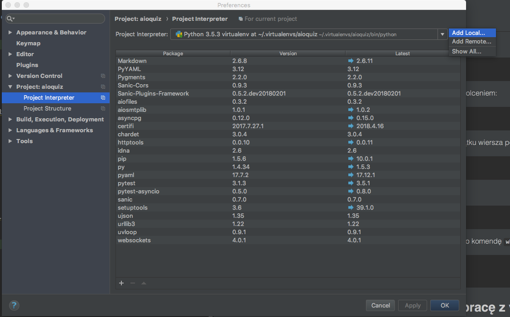
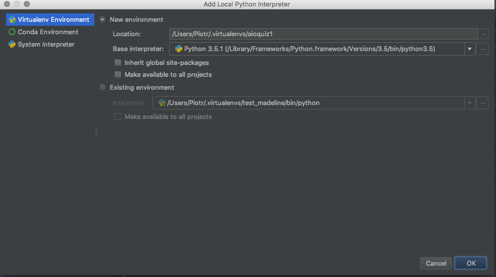

1.23 Virtualenv
=================================

Virtualenv - środowisko wirtualne
---------------------------------

to narzędzie do tworzenia izolowanych środowisk Pythona. 
Virtualenv tworzy folder, zawierający wszystkie zależności dla danego projektu.

Podstawowym problemem, który jest rozwiązywany, są zależności wersji. 
Wyobraź sobie, że masz aplikację, która wymaga wersji 1 LibFoo, ale inna aplikacja wymaga wersji 2. Jak możesz korzystać z obu tych aplikacji? 
Jeżeli zainstalujesz wszystko w globalnym PIP'ie, łatwo jest skończyć w sytuacji, w której nieumyślnie zaktualizujesz aplikację, która nie powinna zostać zaaktualizowana.

Lub bardziej ogólnie - co jeśli chcesz zainstalować aplikację i ją zostawić? Jeśli aplikacja działa, każda zmiana w jej bibliotekach lub zmian wersji tych bibliotek mogą ją popsuć.

Co się stanie, jeśli nie możesz zainstalować pakietów w globalnym katalogu pakietów stron? Na przykład na współdzielonym hoście?

Virtualenv - instalacja
-----------------------

Virtualenva możemy zainstalować używajac Pythonowego mendżera pakietów - pip'a:

```bash
pip install virtualenv
```

lub

```bash
sudo pip install virtualenv
```

Powodzenie instalacji możemy sprawdzić poleceniem:

```bash
virtualenv --version
```


Virtualenv - tworzenie oraz używanie
------------------------------------

Aby stworzyć środowisko wirutalne należy wykonać polecenie:

```bash
virtualenv moj_projekt_env
```

Aby "wejść" do środowiska wirtualnego - zacząć go używać należy je aktywować poleceniem:

```bash
source moj_projekt_env/bin/activate
```
Po użyciu komendy powinna się pojawic jego nazwa w nawiasach na początku wiersza poleceń np. 

```bash
(aioquiz)pdyba:aioquiz Piotr$
```

Aby z niego wyjść, wystarczy polecenie:

```bash
deactivate
```

Aby sprawdzić, czy wszystko działa poprawnie możemy wykorzystać do tego komendę `which` :

```bash
which python
which pip
```

Virtualenvwrapper - nakładka umilająca pracę z virtualenvem
-----------------------------------------------------------

Virtualenvwrapper możemy zainstalować, używając Pythonowego mendżera pakietów - pip'a:


Dla Windowsa:
```bash
pip install virtualenvwrapper-win
```

Dla Linuxa i MacOs'a:
```bash
pip install virtualenvwrapper
```
lub 

```bash
sudo pip install virtualenvwrapper
```

a następnie wykonaj te polecenia lub dodaj je do plików profili Twoich powłok - .bashrc, .profile np. `~/.bashrc` :

```bash
export WORKON_HOME=$HOME/.virtualenvs
source /usr/local/bin/virtualenvwrapper.sh
```

od tego momentu będziesz mogła/mógł używać poleceń:

do tworzenia:
```bash
mkvirtualenv moj_env
```
do aktywowania:
```bash
workon moj_env
```
Wykorzystując virtualenvwrapper z powyższą konfiruacją wszystkie środowiska będa tworzone w folderze `~/.virtualenvs`

Wybór Pythona dla Virtualenv i Virtualenvwrapper
------------------------------------------------

W tym celu wykorzystujemy argumenty:
`-p PYTHON_EXE` lub `--python=PYTHON_EXE`

np.:
```bash
mkvirtualenv moj_env -p python3.6
```
lub
```bash
virtualenv moj_projekt_env --python=/Library/Frameworks/Python.framework/Versions/3.5/bin/python3
```

Virtualenv w PyCharmie
----------------------

Pycharm posiada wbudowaną obługę środowisk virtualnych dostępną w Ustawieniach/Projekt/Interpretor (preferences/project/interpeter)



