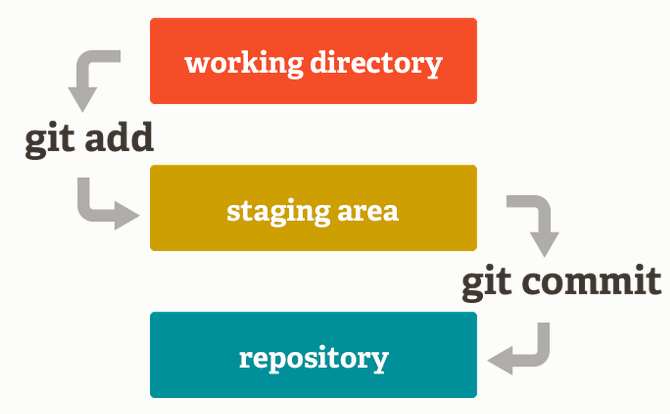

1.4 Praca z Git i Github
=============================================

**Git** - system *kontroli wersji*, pozwalający na śledzenie historii zmian w plikach, wycofywanie ich, porównywanie między wersjami

**GitHub** - usługa webowa hostująca repozytoria Git, służąca do *kolaboracji* z wykorzystaniem Gita

Instalacja Git
---------------------------------
[Windows](https://git-scm.com/book/pl/v1/Pierwsze-kroki-Instalacja-Git#Instalacja-w-systemie-Windows "Instalacja-w-systemie-Windows")

[Mac](https://git-scm.com/book/pl/v1/Pierwsze-kroki-Instalacja-Git#Instalacja-na-komputerze-Mac "Instalacja-na-komputerze-Mac")

[Linux](https://git-scm.com/book/pl/v1/Pierwsze-kroki-Instalacja-Git#Instalacja-w-systemie-Linux "Instalacja-w-systemie-Linux")

Konfiguracja Gita
---------------------------------
Sprawdź czy masz zainstalowanego Gita

```bash
git --version

git --version

```

Ustaw nazwę użytkownika

```bash
git config --global user.name "Jan Nowak"

git config --global user.name "Jan Nowak"

```

Ustaw email użytkownika

```bash
git config --global user.email jannowak@example.com

git config --global user.email jannowak@example.com

```

Podstawowy sposób pracy z Git
---------------------------------


[source](http://cdn-ak.f.st-hatena.com/images/fotolife/k/keiwt/20150310/20150310235540.png)

Stwórz repozytorium Git w aktualnym folderze

```bash
git init .

git init .

```

Dodaj śledzone pliki do przechowalni

```bash
git add <nazwa_pliku>

git add <nazwa_pliku>

```

Zatwierdź zmiany, zapisując zawartość plików w historii katalogu Git

```bash
git commit -m “Krótki opis”

git commit -m “Krótki opis”

```

[Podstawy Git](https://git-scm.com/book/pl/v1/Pierwsze-kroki-Podstawy-Git)

[Rejestrowanie zmian](https://git-scm.com/book/pl/v1/Podstawy-Gita-Rejestrowanie-zmian-w-repozytorium)

Śledzenie i wycofywanie zmian
---------------------------------

Wyświetl aktualny stan repozytorium (które pliki zostały zmienione)

```bash
git status

git status

```

Wyświetl aktualny stan repozytorium (jakie zmiany zostały wprowadzone)

```bash
git diff

git diff

```

Wyświetl historię zapisanych zmian

```bash
git log

git log

```

Wycofaj zmiany wprowadzone w staging area

```bash
git reset HEAD <nazwa_pliku>

git reset HEAD <nazwa_pliku>

```

Wycofaj zmiany wprowadzone w working directory

```bash
git checkout <nazwa_pliku>

git checkout <nazwa_pliku>

```

Wycofaj ostatnią zapisaną zmianę (commit)

```bash
git revert HEAD

git revert HEAD

```

Konfiguracja GitHuba - klucze SSH
---------------------------------

Wygeneruj klucz SSH

```bash
ssh-keygen -t rsa -b 4096 -C "your_email@example.com"

ssh-keygen -t rsa -b 4096 -C "your_email@example.com"

```

Skopiuj klucz do schowka

```bash
clip < ~/.ssh/id_rsa.pub

clip < ~/.ssh/id_rsa.pub

```

[Dodaj klucz do konta na GitHub](https://ipatryk.pl/polaczenie-do-github-przez-ssh/)

Zdalne repozytorium
---------------------------------

Podepnij zdalne repozytorium do repozytorium lokalnego

```bash
git remote add origin git@github.com:/user/repo.git

git remote add origin git@github.com:/user/repo.git

```

Sprawdź adres zdalnego repozytorium

```bash
git remote -v

git remote -v

```

Zmień adres zdalnego repozytorium

```bash
git remote set-url origin git@github.com:/user/repo.git

git remote set-url origin git@github.com:/user/repo.git

```

Dodaj zmiany zapisane lokalnie do zdalnego repozytorium

```bash
git push

git push

```

Swórz kopię lokalną zdalnego repozytorium

```bash
git clone git@github.com:user/repo.git

git clone git@github.com:user/repo.git

```

[Dodawanie repozytorium zdalnego](https://help.github.com/articles/adding-a-remote/)

[Zmiana adresu zdalnego repozytorium](https://help.github.com/articles/changing-a-remote-s-url/)

Najważniejsze pojęcia
---------------------------------
**Branch (Gałąź)** - To Twoja bezpieczna strefa do eksperymentów. Możesz na niej swobodnie wprowadzać zmiany, bez obaw, że popsujesz działającą już wersję kodu. Gałęzie tworzymy za pomocą polecenia `git checkout -b <nazwa_gałęzi>`. Po zakończeniu pracy nad nowymi zmianami i zapisaniu ich, możesz scalić swoją eksperymentalną gałąź ze źródłem projektu przechodząc do niego przez polecenie `git checkout master`, a następnie wywołując polecenie `git merge <nazwa_gałęzi>`.

**Clone** - Lokalna kopia zdalnego repozytorium. Znajdujące się na serwerze repozytoria (np. na GitHub, Bitbucket czy GitLab), możemy skopiować lokalnie, za pomocą polecenia `git clone <adres_zdalnego_repozytorium>` . Dzięki temu, możemy pracować na tym repozytorium tak samo, jak na każdym innym stworzonym przez nas lokalnym repozytorium.

**Commit** - Zapisanie stanu projektu w historii wersji. Tworzy się je za pomocą polecenia `git commit -m "krótki opis"`. Każdy commit stanowi swoistą migawkę stanu projektu do którego możesz zawsze wrócić. Listę dotychczas zapisanych commitów możesz przeglądać wpisując polecenie `git log`.

**Fork** - Zdalna kopia innego zdalnego repozytorium. Forka tworzymy gdy chcemy na swoim koncie GitHub zapisać kopię czyjegoś repozytorium również dostępnego na GitHub. Forki tworzymy poprzez GitHuba, wchodząc na adres repozytorium, które chcemy skopiować i klikając odpowiednią ikonkę.

**Git Repository** - Repozytorium to w zasadzie folder zawierający wszystkie pliki jakie chcesz śledzić za pomocą Gita. Zwykle tworzy się jedno repozytorium per projekt. Repozytoria lokalne tworzymy za pomocą polecenia `git init .`.

**Master (Źródło)** - To główny branch w repozytorium, tworzony przez Git domyślnie przy zainicjalizowaniu repozytorium. Tworząc rozbudowany projekt, szczególnie we spółpracy z innymi osobami, do mastera nie powinno się bezpośrednio commitować. To rdzeń Twojego projektu, który powinien zawierać najświeższą, działającą wersję kodu i stanowić punkt wyjścia dla osób, które chcą dołączyć do Twojego projektu.

**Pull Request** - Gdy uznasz, że Twój kod z gałęzi gotowy jest do zapisania w źródle (np. wnosi kompletną zmianę, tzw. feature, lub poprawia w całości jakiś błąd, tzw. bug fix), tworzysz Pull Request. Osoby, z którymi współpracujesz nad projektem, mogą wtedy przejrzeć Twoje zmiany, zasugerować poprawki lub zaakceptować je. Wprowadzanie zmian przez pull requesty pozwala na zachowanie transparentności w projekcie oraz uniknięcie głupich błędów (np. zakomentowane linijki kodu, literówki). Co dwie głowy to nie jedna. ;)

**Remote (zdalne repozytorium)** - To wersja Twojego projektu utrzymywana na serwerze dostępnym przez internet (np. na serwerach GitHuba). Zapisywanie projektów w repozytoriach zdalnych znacznie ułatwia współpracę w grupie, ponieważ Twoje repozytorium nie jest dostępne jedynie na Twojej maszynie, ale w sieci, do której dostęp może mieć wielu użytkowników. Po stworzeniu takiego repozytorium na serwerze, możesz dodać je jako repozytorium zdalne do swojego lokalnego projektu za pomocą polecenia `git remote add <url_zdalnego_repozytorium>`. Aby dodać zmiany z lokalnego repozytorium do repozytorium zdalnego wystarczy użyć polecenia `git push`.

**Staging area (poczekalnia)** - Przestrzeń, w której zmiany w śledzonych plikach czekają na zatwierdzenie. Jest to swoista poczekalnia, w której śledzone w plikach zmiany czekają na zapisanie w historii projektu. Zmienione pliki możesz dodać do tej poczekalni za pomocą polecenia `git add <nazwa_pliku>`.

**Working directory (katalog roboczy)** - To twój katalog roboczy. Stan Twojego katalogu roboczego możesz sprawdzić za pomocą polecenia `git status`. Wyświetli Ci się wtedy lista wszystkich plików, które zostały zmodyfikowane od ostatniego commita, w tym tych, które zostały dodane bądź usunięte.

Kursy i tutoriale
---------------------------------
[Git & GitHub for Poets](https://www.youtube.com/playlist?list=PLRqwX-V7Uu6ZF9C0YMKuns9sLDzK6zoiV)

[Kurs Git na Codecademy](https://www.codecademy.com/learn/learn-git)

Kursy Git i GitHub na Udacity:

* [Git i Github](https://www.udacity.com/course/how-to-use-git-and-github--ud775)

* [Kontrola wersji](https://www.udacity.com/course/version-control-with-git--ud123)

* [Kolaboracja](https://www.udacity.com/course/github-collaboration--ud456)

[Tutorial Projekt Programistka](https://magnifikajf.com/2017/06/24/jak-ogarnac-git-a-i-stworzyc-repozytorium-na-github-ie-w-10-dni/)

[Integracja Gita  z Pycharmem](https://www.youtube.com/watch?v=jFnYQbUZQlA)
